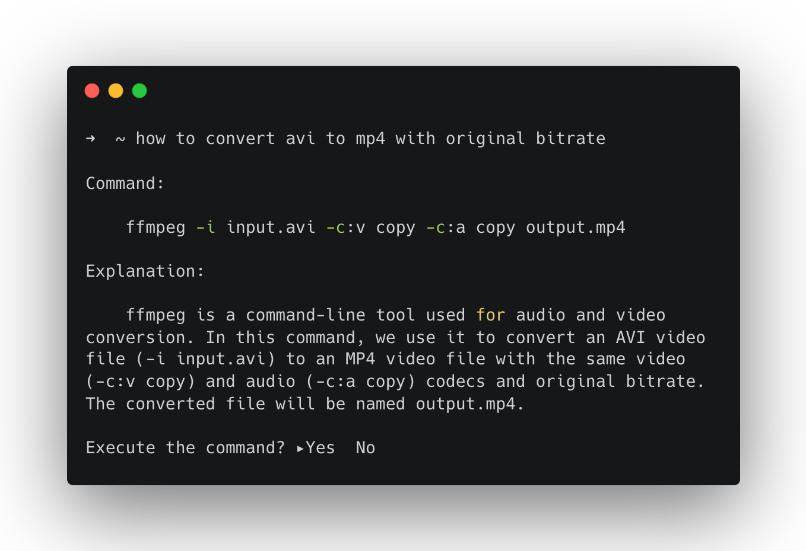

# how
Copilot for your terminal, powered by Azure Cognitive Services

## Features

- Works as a copilot for your terminal, simply types `how <question>` to ask it anything.
- Powered by Azure Cognitive Services. Can easily migrate to OpenAI as it's now built on top of [go-openai](https://github.com/sashabaranov/go-openai) which supports both Azure and OpenAI APIs.
- Uses PowerShell under Windows and bash under *nix.
- Directly execute the command.

## Usage

1. Prerequisite: have `go` installed; have a valid Azure model deployment.
2. Clone this repo.
3. Open `main.go`, fill in your Azure credentials. You must have a valid Azure model deployment. Please see __Prerequisite__ section of [Azure documentation](https://learn.microsoft.com/en-us/azure/cognitive-services/openai/chatgpt-quickstart?tabs=command-line&pivots=rest-api).
4. Build with `go build .`, then copy the `how` binary to anywhere in `PATH` you like, e.g. `/usr/local/bin/`.

## License

`how` is available under MIT license. See the [LICENSE](LICENSE) file for more info.